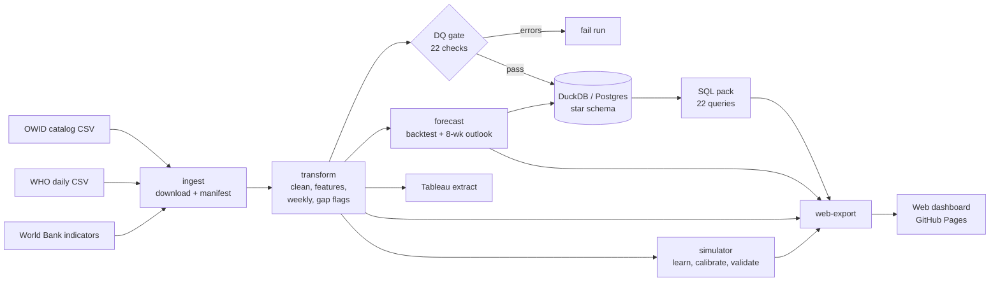

# COVID-19 Analytics

A global healthcare burden pipeline: an end-to-end analytics project that turns three public datasets, **Our World in Data**, the **WHO** and the **World Bank's** development indicators, into a tested, quality-gated star-schema warehouse, a 22-query SQL analysis pack, a weekly deaths forecast with an honest backtest, a pandemic scenario simulator trained on that data, and an eight-page interactive web dashboard.

**Live dashboard:** [aagamshah15.github.io/COVID-19-Analytics](https://aagamshah15.github.io/COVID-19-Analytics/), rebuilt from the live sources every Monday.

**Coverage:** 239 countries and territories, 1 Jan 2020 to 31 Dec 2023, daily and weekly grain.
**Runtime:** about 30 seconds on a laptop for the pipeline, plus about 13 minutes to train and validate the simulator (`--skip-simulator` leaves that out) and under a minute to download the sources.

```bash
pip install -e ".[dev]"
covid-pipeline run          # download -> curate -> DQ gate -> warehouse -> forecast -> simulator -> export
covid-pipeline web-export   # data files for the dashboard
cd dashboard && npm install && npm run dev
```

---

## What the data shows

| | |
|---|---|
| Reported deaths, 2020–2023 | **7.02 million** across 237 reporting countries (774M reported cases) |
| Deadliest week | **24 Jan 2021**: 103,700 deaths, before vaccines were widely available |
| Severity | Case fatality rate fell from **5.5%** (H1 2020) to **0.2–0.7%** (2022–23) |
| Hardest hit (deaths per million) | Peru (6,587), Bulgaria (5,659), North Macedonia (5,415) |
| By continent (deaths per million) | South America 3,151 · Europe 2,798 · North America 2,720 · Asia 345 · Africa 179 |
| Hospital strain | At peak, COVID-19 patients filled **25%** of Serbia's and **23%** of the UK's total hospital beds |
| Vaccination | 65% of the world fully vaccinated by end-2023 (population-weighted) |

The full narrative, including why the vaccination comparison is confounded, is in [`notebooks/01_healthcare_burden_story.ipynb`](notebooks/01_healthcare_burden_story.ipynb).

## Architecture



| Stage | Module | Output |
|---|---|---|
| Ingest | [`ingest.py`](src/covid_pipeline/ingest.py) | `data/raw/*.csv` exactly as downloaded, plus `manifest.json` (URL, timestamp, size, sha256) |
| Transform | [`transform.py`](src/covid_pipeline/transform.py) | `data/processed/covid_daily.parquet`, `covid_weekly.parquet` |
| Quality gate | [`quality.py`](src/covid_pipeline/quality.py) | `reports/dq_report.csv`; the run stops on any error-level failure |
| Warehouse | [`warehouse.py`](src/covid_pipeline/warehouse.py), [`schema.sql`](warehouse/schema.sql) | `warehouse/covid_dw.duckdb` (or PostgreSQL) |
| Forecast | [`forecast.py`](src/covid_pipeline/forecast.py) | `data/processed/forecast_weekly_deaths.csv`, `reports/forecast_metrics.json` |
| Simulator | [`simulator/`](src/covid_pipeline/simulator) | `data/processed/simulator.json` (the trained model the dashboard loads), `reports/simulator_metrics.json` |
| Web export | [`web.py`](src/covid_pipeline/web.py) | `dashboard/public/data/*.json`: weekly series per country, SQL-pack results, forecasts, DQ report |
| Dashboard | [`dashboard/`](dashboard) | Static Svelte site, deployed to GitHub Pages |
| Export | [`export.py`](src/covid_pipeline/export.py) | `data/processed/tableau_exec_extract.csv` (actuals and forecasts, one long table) |

## Data sources and the problems they hide

| Source | URL | Role |
|---|---|---|
| Our World in Data | `catalog.ourworldindata.org/garden/covid/latest/compact/compact.csv` | Primary: cases, deaths, vaccinations, hospital/ICU occupancy, country attributes |
| WHO | `srhdpeuwpubsa.blob.core.windows.net/whdh/COVID/WHO-COVID-19-global-daily-data.csv` | Fills gaps in daily cases/deaths; supplies the WHO region |
| World Bank | `api.worldbank.org/v2` (44 indicators, 2010–2019) | Simulator inputs: age structure, urban share, physicians, health spending, service coverage, routine immunisation |

The World Bank API has outages. During one, the run uses a versioned snapshot ([`data/reference/worldbank_wdi_snapshot.json`](data/reference/worldbank_wdi_snapshot.json)) and records that in the manifest; `covid-pipeline worldbank-snapshot` refreshes it.

Problems the pipeline handles explicitly, each covered by a test:

- **Different country codes.** WHO uses ISO-2 codes and OWID uses ISO-3. Codes are mapped with `pycountry` (Kosovo becomes `OWID_KOS`), and international conveyances such as cruise ships are dropped. The join matches **98.7%** of rows.
- **Namibia's ISO code is `NA`,** which pandas reads as a missing value by default. Fields are only treated as missing when they're empty.
- **The WHO header has a byte-order mark,** so the first column wouldn't be named `Date_reported` without decoding it as `utf-8-sig`.
- **Reporting stops are recorded as zeros.** For example, OWID shows Brazil with 0 deaths every week from May 2023. A run of at least 8 exact-zero weeks after a period averaging 10 or more deaths a week becomes a **null** (`deaths_reported = false`), so stopped reporting isn't read as "COVID ended". In total, 27 countries had stopped reporting deaths by Dec 2023.
- **Negative daily counts** (back-dated revisions) are clipped to 0 and counted in the DQ report.
- **More deaths than cases** (e.g. France in spring 2020, which counted care-home deaths before matching cases): the case fatality rate is left undefined there.
- **Aggregate rows** (World, continents, income groups) are excluded; they're identified by having no continent.

## Data quality gate

Each check has a severity. **Errors stop the run; warnings are reported but don't block it.** The previous version averaged pass rates into one score, so stale data still scored 99.98%. The gate now explicitly checks that the data reaches the requested end date.

| Severity | Checks |
|---|---|
| error | data present · coverage reaches start and end dates · ≥150 countries · non-null keys · unique country-day and country-week · non-negative flows · CFR ≤ 1 |
| warn | cumulative deaths never decrease · negative revisions clipped · vaccination ≤ 110% of population · deaths ≤ cases · WHO match rate ≥ 90% · death reporting still active at end · 2022 vaccination coverage ≥ 60% · six checks on the simulator's inputs (age structure, excess mortality and stringency coverage, plausible reproduction rates) |

The current results are in [`reports/dq_report.csv`](reports/dq_report.csv): all error-level checks pass, and there are 6 warnings, each tied to a known issue in the source data.

## Warehouse

A star schema ([`warehouse/schema.sql`](warehouse/schema.sql)) that runs unchanged on DuckDB and PostgreSQL:

- `dim_date`: a continuous calendar that extends a year past the data so forecast weeks resolve, with ISO week and `is_week_end` flags.
- `dim_country`: ISO code, continent, WHO region, population, hospital beds, median age, GDP, life expectancy, HDI.
- `fact_covid_daily` (345k rows), `fact_covid_weekly` (49k rows, keyed on the week-ending Sunday) and `fact_forecast_weekly`.

Foreign keys are `NOT NULL` and enforced, so facts can't be orphaned. Loads run in a single transaction: a failed load leaves the previous warehouse intact.

**Metric naming convention.** `weekly_*` columns are flows, so they can be summed or averaged over time. `cumulative_*` columns are running totals and should be read at one date, never averaged across dates. `*_rate` columns are shares of population.

## SQL analysis pack

[`sql/analytical_queries.sql`](sql/analytical_queries.sql) contains 22 named queries in portable SQL, in five sections: executive pulse, country burden, vaccination, health-system strain, and segmentation/coverage/outlook. Cross-country rates are population-weighted, and country rankings exclude populations under 1M. [`tests/test_sql_pack.py`](tests/test_sql_pack.py) runs every query against a test warehouse.

```python
from covid_pipeline.warehouse import load_query_pack
import duckdb
con = duckdb.connect("warehouse/covid_dw.duckdb", read_only=True)
con.execute(load_query_pack()["q06_top_countries_cumulative_deaths_per_million"]).fetchdf()
```

## Forecasting

**Target:** weekly deaths per country, 8 weeks ahead.

- **One model pooled across 161 countries** (population ≥ 1M), trained on log deaths per million. A single country has only about 200 weekly data points, too few to train its own model.
- **Direct multi-horizon:** one model per week ahead. Each uses only information known at the forecast date, so no future cases or vaccination data leak in.
- **Predicts the change from the current week,** and that change is blended 50/50 with persistence (assuming next week equals this week). Weekly deaths move slowly, so persistence is a hard baseline to beat; the earlier model that predicted absolute levels lost to it.
- **Backtest:** 6 expanding-window folds from July 2022 to Dec 2023, scored against naive persistence. 80% prediction intervals come from the backtest residuals.
- **Countries not reporting at the forecast date aren't forecast.**

| Backtest | MAE (model) | MAE (naive) | Skill vs naive |
|---|---|---|---|
| All 161 countries | 34.0 deaths/wk | 39.0 | **+12.9%** |
| Focus: US, India, Russia, Italy, France | 177.7 | 192.7 | **+7.8%** |

Skill on the focus countries peaks at **+17% at 5 weeks ahead** and turns slightly negative by week 8; the full breakdown is in [`notebooks/02_forecast_review.ipynb`](notebooks/02_forecast_review.ipynb). By country, the model clearly beats naive for France (+29%), Italy (+26%) and Russia (+23%), and roughly ties it for the US and India. India's series includes reporting backlog dumps that no model can anticipate.

## Pandemic simulator

The Simulator page answers "what if a new disease reached a country like this one?". A visitor picks a place, a disease and a response, presses Run, and gets a plain-language result with ranges, the same outbreak with no response for contrast, the inputs that matter most, and a PDF report. Six ready-made scenarios run in one click.

**The design is a hybrid.** A model trained only on COVID-19 cannot extrapolate to a disease three times as contagious, so the outbreak itself is simulated by a standard epidemiological engine: an age-structured SEIR model with vaccination, hospital overload, waning immunity, seasonality and people cutting contacts as deaths rise. What the data supplies is the engine's country-specific inputs:

| Learned from the data | Technique | Result |
|---|---|---|
| How much lockdowns cut transmission, and how the effect fades | Panel regression with country fixed effects (152 countries) | 27–40% lower transmission at stringency 80, by period |
| Each country's transmission, severity and public caution | The engine calibrated to 137 countries' 2020 death curves | Median fit error 0.54 in log weekly deaths |
| Those values for a country with no fit, or a hypothetical one | Ridge regression on 13 country characteristics, cross-validated by country | Beats gradient boosting and a mean-only baseline |
| Vaccine acceptance and rollout speed | Logistic curves fitted to 157 rollouts, then regression | Cross-validated R² 0.31 and 0.48 |
| Share of deaths that get reported | Regression on excess mortality (86 countries) | Cross-validated R² 0.23; flagged as weak |
| A second opinion on wave severity | Classifier trained on 381 real waves | ROC-AUC 0.79, against 0.53 for wave era alone |
| Countries most like this one | Clustering and nearest neighbours | The real 2020–21 curves of the closest matches |

**Validation is reported as it came out.** On data the fit never saw, the simulator beats its own stripped-down versions: without people reacting to deaths its error is four times higher, and without country characteristics 70% higher. It does not beat simple statistical baselines: persistence on the time holdout (mean absolute error 23.5 against 16.7 weekly deaths per million) or a continent average on unseen countries (19.2 against 12.0). That is why the page presents scenarios, not forecasts. The numbers are in [`reports/simulator_metrics.json`](reports/simulator_metrics.json) and the reasoning in [`notebooks/03_simulator_models.ipynb`](notebooks/03_simulator_models.ipynb); the literature behind the engine and every disease preset is in [`docs/simulator/RESEARCH.md`](docs/simulator/RESEARCH.md).

**Scenarios run in the browser.** The engine is written twice: a Python reference used for calibration, and a TypeScript port that runs in a Web Worker with 200 Monte Carlo draws. Golden scenarios hold the two to the same outputs, to within one part in a billion ([`engine.test.ts`](dashboard/src/lib/sim/engine.test.ts)).

**An optional cloud API** serves the Python engine from Google Cloud Run's free tier for heavier work: 2,000 draws and Sobol sensitivity indices. The page never depends on it. Its endpoints, cost guards and setup are in [`docs/simulator/CLOUD.md`](docs/simulator/CLOUD.md).

## CLI

```bash
covid-pipeline run [--offline] [--start-date 2020-01-01] [--end-date 2023-12-31] \
                   [--target duckdb|postgres] [--postgres-url URL] \
                   [--horizon-weeks 8] [--top-n 5] [--skip-forecast] [--skip-simulator]

covid-pipeline ingest [--offline]      # download sources + manifest
covid-pipeline transform               # raw -> curated parquet
covid-pipeline dq                      # quality gate on curated data
covid-pipeline warehouse [--target postgres --postgres-url ...]
covid-pipeline forecast [--horizon-weeks 8 --top-n 5]
covid-pipeline web-export              # web dashboard data files
covid-pipeline export                  # Tableau / Power BI extract
covid-pipeline sim-train               # fit, calibrate and validate the simulator
covid-pipeline sim-fixtures            # golden scenarios the browser engine is tested against
covid-pipeline worldbank-snapshot      # refresh the World Bank fallback copy
```

`--offline` reuses the cached raw files. Without it, a failed download stops the run instead of silently falling back to old data. PostgreSQL support needs `pip install -e ".[postgres]"`; the connection URL can also come from `$POSTGRES_URL`.

## Dashboard

An eight-page interactive dashboard in [`dashboard/`](dashboard), with light and dark themes, live at [aagamshah15.github.io/COVID-19-Analytics](https://aagamshah15.github.io/COVID-19-Analytics/). The design brief, reference review and visual system are in [`docs/dashboard/DESIGN.md`](docs/dashboard/DESIGN.md).

| Page | What it answers |
|---|---|
| Overview | What happened, in one minute: the timeline spine (drag it to choose a period), headline numbers, three findings |
| Where it hit | Which places carried the heaviest burden: world map, rankings, continent waves |
| Country | Any country against its continent and the world: waves, vaccination, hospital strain, peers, reporting gaps |
| Vaccines | How severity fell as coverage rose, and why raw country comparisons mislead |
| Hospitals | Peak share of hospital beds taken by COVID-19 patients, week by week |
| Outlook | The 8-week forecast with its 80% range and its skill against a naive baseline |
| Simulator | What a new outbreak could do in a country like this one, and which choices change the outcome |
| Data | The quality gate, source fingerprints, and where reporting stopped |

Design rules: each metric keeps one hue everywhere (deaths oxblood, cases indigo, vaccination teal, hospital strain amber), validated for color-vision deficiency in both themes; reporting gaps are hatched, never drawn as zero; every chart has a table view and names the SQL query behind it; all filters live in the URL, so any view is shareable.

Headline numbers come from the SQL-pack results exported by `web-export`. Interactive re-aggregation by region and period happens in the browser, and [`aggregate.test.ts`](dashboard/src/lib/data/aggregate.test.ts) checks it reproduces the SQL pack exactly.

```bash
cd dashboard
npm install
npm run dev          # http://localhost:5173
npm test             # parity tests against the SQL pack and the Python engine (the data-dependent ones need `covid-pipeline web-export` first)
npm run build        # static site in dashboard/dist
```

**Tableau / Power BI:** `data/processed/tableau_exec_extract.csv` holds weekly actuals and forecasts in one long table (`record_type = actual | forecast`). The older `dashboards/tableau/Dashboard1.twbx` was built on the previous extract and needs re-pointing: `cases_per_million` is now `cumulative_cases_per_million`, `aged_65_older` is replaced by `median_age`, and the weekly date column is `week_end`.

## Development

```bash
python3.12 -m venv .venv && source .venv/bin/activate
pip install -e ".[dev,api,notebooks,postgres]"
ruff check src tests api && pytest
```

CI ([`.github/workflows/ci.yml`](.github/workflows/ci.yml)) lints and tests the pipeline and the API, and type-checks, tests and builds the dashboard on every push. [`.github/workflows/pipeline.yml`](.github/workflows/pipeline.yml) rebuilds everything from the live sources weekly, on demand and on pushes to `main`: it retrains the simulator, runs the dashboard's parity tests, uploads the reports and warehouse as artifacts, and publishes the dashboard to GitHub Pages. [`.github/workflows/api.yml`](.github/workflows/api.yml) deploys the optional cloud API once it has been set up.

```
src/covid_pipeline/   ingest, worldbank, transform, quality, warehouse, forecast, export, web, cli, config
  simulator/          engine, scenario layer, features, calibration, learned models, training, analysis
api/                  optional cloud API for the simulator (FastAPI, Dockerfile)
infra/                one-time Google Cloud setup for the API
dashboard/            Svelte + TypeScript web dashboard (pages, charts, simulator engine, state, tests)
docs/                 dashboard design brief; simulator research notes and cloud guide
sql/                  analytical query pack
warehouse/            schema.sql (+ generated covid_dw.duckdb)
notebooks/            01 burden story, 02 forecast review, 03 simulator models (executed)
reports/              dq_report.csv, forecast_metrics.json, simulator_metrics.json (versioned)
tests/                181 tests on synthetic fixtures that reproduce the real data's quirks
```

## Limitations

- **Reported deaths are not total deaths.** The WHO estimates 14.9M excess deaths in 2020–2021 against 5.4M reported, roughly 2.7× higher, with the biggest gaps where death registration is weak. Treat low figures (Africa, South Asia) as a floor.
- **Cases became unreliable from 2022** as testing collapsed, which distorts CFR and per-case metrics in 2023.
- **Hospital figures are sparse.** 42 countries publish COVID-19 hospital or ICU patient counts (36 report hospital patients), mostly in Europe and the Americas.
- **The vaccination comparisons are associations, not causal effects.** More-vaccinated countries are also older, richer and test more.
- **The simulator produces scenarios, not forecasts.** It does not beat simple baselines at prediction (see above), every age group mixes evenly with every other, and everything it learned comes from one pandemic. Diseases unlike COVID-19 lean on published parameters, and the page says which inputs are assumptions.
