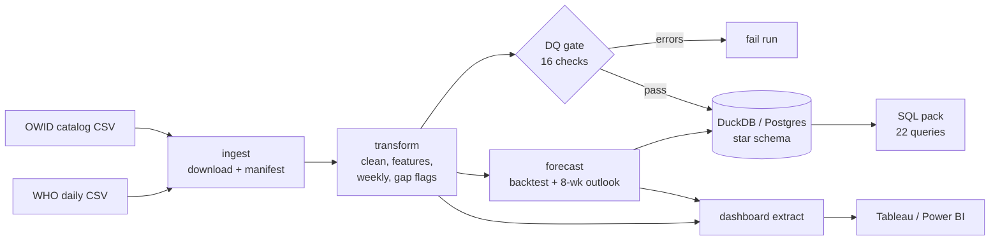

# COVID-19 Global Healthcare Burden Pipeline

An end-to-end analytics pipeline that turns the two reference COVID-19 datasets, **Our World in Data** and the **WHO**, into a tested, quality-gated star-schema warehouse, a 22-query SQL analysis pack, a weekly deaths forecast with an honest backtest, and a dashboard-ready extract.

**Coverage:** 239 countries and territories, 1 Jan 2020 to 31 Dec 2023, daily and weekly grain.
**Runtime:** about 30 seconds end to end on a laptop, plus about 20 seconds to download the sources.

```bash
pip install -e ".[dev]"
covid-pipeline run          # download -> curate -> DQ gate -> warehouse -> forecast -> export
pytest                      # 49 tests, ~5s
```

---

## What the data shows

| | |
|---|---|
| Reported deaths, 2020–2023 | **7.02 million** across 237 reporting countries (774M reported cases) |
| Deadliest week | **24 Jan 2021**: 103,700 deaths, before vaccines were widely available |
| Severity | Case fatality rate fell from **5.5%** (H1 2020) to **0.2–0.7%** (2022–23) |
| Hardest hit (deaths per million) | Peru (6,587), Bulgaria (5,659), North Macedonia (5,415) |
| By continent (deaths per million) | South America 3,151 · Europe 2,798 · North America 2,720 · Asia 345 · Africa 179 |
| Hospital strain | At peak, COVID-19 patients filled **25%** of Serbia's and **23%** of the UK's total hospital beds |
| Vaccination | 65% of the world fully vaccinated by end-2023 (population-weighted) |

The full narrative, including why the vaccination comparison is confounded, is in [`notebooks/01_healthcare_burden_story.ipynb`](notebooks/01_healthcare_burden_story.ipynb).

## Architecture



| Stage | Module | Output |
|---|---|---|
| Ingest | [`ingest.py`](src/covid_pipeline/ingest.py) | `data/raw/*.csv` exactly as downloaded, plus `manifest.json` (URL, timestamp, size, sha256) |
| Transform | [`transform.py`](src/covid_pipeline/transform.py) | `data/processed/covid_daily.parquet`, `covid_weekly.parquet` |
| Quality gate | [`quality.py`](src/covid_pipeline/quality.py) | `reports/dq_report.csv`; the run stops on any error-level failure |
| Warehouse | [`warehouse.py`](src/covid_pipeline/warehouse.py), [`schema.sql`](warehouse/schema.sql) | `warehouse/covid_dw.duckdb` (or PostgreSQL) |
| Forecast | [`forecast.py`](src/covid_pipeline/forecast.py) | `data/processed/forecast_weekly_deaths.csv`, `reports/forecast_metrics.json` |
| Export | [`export.py`](src/covid_pipeline/export.py) | `data/processed/tableau_exec_extract.csv` (actuals and forecasts, one long table) |

## Data sources and the problems they hide

| Source | URL | Role |
|---|---|---|
| Our World in Data | `catalog.ourworldindata.org/garden/covid/latest/compact/compact.csv` | Primary: cases, deaths, vaccinations, hospital/ICU occupancy, country attributes |
| WHO | `srhdpeuwpubsa.blob.core.windows.net/whdh/COVID/WHO-COVID-19-global-daily-data.csv` | Fills gaps in daily cases/deaths; supplies the WHO region |

Problems the pipeline handles explicitly, each covered by a test:

- **Different country codes.** WHO uses ISO-2 codes and OWID uses ISO-3. Codes are mapped with `pycountry` (Kosovo becomes `OWID_KOS`), and international conveyances such as cruise ships are dropped. The join matches **98.7%** of rows.
- **Namibia's ISO code is `NA`,** which pandas reads as a missing value by default. Fields are only treated as missing when they're empty.
- **The WHO header has a byte-order mark,** so the first column wouldn't be named `Date_reported` without decoding it as `utf-8-sig`.
- **Reporting stops are recorded as zeros.** For example, OWID shows Brazil with 0 deaths every week from May 2023. A run of at least 8 exact-zero weeks after a period averaging 10 or more deaths a week becomes a **null** (`deaths_reported = false`), so stopped reporting isn't read as "COVID ended". In total, 27 countries had stopped reporting deaths by Dec 2023.
- **Negative daily counts** (back-dated revisions) are clipped to 0 and counted in the DQ report.
- **More deaths than cases** (e.g. France in spring 2020, which counted care-home deaths before matching cases): the case fatality rate is left undefined there.
- **Aggregate rows** (World, continents, income groups) are excluded; they're identified by having no continent.

## Data quality gate

Each check has a severity. **Errors stop the run; warnings are reported but don't block it.** The previous version averaged pass rates into one score, so stale data still scored 99.98%. The gate now explicitly checks that the data reaches the requested end date.

| Severity | Checks |
|---|---|
| error | data present · coverage reaches start and end dates · ≥150 countries · non-null keys · unique country-day and country-week · non-negative flows · CFR ≤ 1 |
| warn | cumulative deaths never decrease · negative revisions clipped · vaccination ≤ 110% of population · deaths ≤ cases · WHO match rate ≥ 90% · death reporting still active at end · 2022 vaccination coverage ≥ 60% |

The current results are in [`reports/dq_report.csv`](reports/dq_report.csv): all error-level checks pass, and there are 5 warnings, each tied to a known issue in the source data.

## Warehouse

A star schema ([`warehouse/schema.sql`](warehouse/schema.sql)) that runs unchanged on DuckDB and PostgreSQL:

- `dim_date`: a continuous calendar that extends a year past the data so forecast weeks resolve, with ISO week and `is_week_end` flags.
- `dim_country`: ISO code, continent, WHO region, population, hospital beds, median age, GDP, life expectancy, HDI.
- `fact_covid_daily` (345k rows), `fact_covid_weekly` (49k rows, keyed on the week-ending Sunday) and `fact_forecast_weekly`.

Foreign keys are `NOT NULL` and enforced, so facts can't be orphaned. Loads run in a single transaction: a failed load leaves the previous warehouse intact.

**Metric naming convention.** `weekly_*` columns are flows, so they can be summed or averaged over time. `cumulative_*` columns are running totals and should be read at one date, never averaged across dates. `*_rate` columns are shares of population.

## SQL analysis pack

[`sql/analytical_queries.sql`](sql/analytical_queries.sql) contains 22 named queries in portable SQL, in five sections: executive pulse, country burden, vaccination, health-system strain, and segmentation/coverage/outlook. Cross-country rates are population-weighted, and country rankings exclude populations under 1M. [`tests/test_sql_pack.py`](tests/test_sql_pack.py) runs every query against a test warehouse.

```python
from covid_pipeline.warehouse import load_query_pack
import duckdb
con = duckdb.connect("warehouse/covid_dw.duckdb", read_only=True)
con.execute(load_query_pack()["q06_top_countries_cumulative_deaths_per_million"]).fetchdf()
```

## Forecasting

**Target:** weekly deaths per country, 8 weeks ahead.

- **One model pooled across 161 countries** (population ≥ 1M), trained on log deaths per million. A single country has only about 200 weekly data points, too few to train its own model.
- **Direct multi-horizon:** one model per week ahead. Each uses only information known at the forecast date, so no future cases or vaccination data leak in.
- **Predicts the change from the current week,** and that change is blended 50/50 with persistence (assuming next week equals this week). Weekly deaths move slowly, so persistence is a hard baseline to beat; the earlier model that predicted absolute levels lost to it.
- **Backtest:** 6 expanding-window folds from July 2022 to Dec 2023, scored against naive persistence. 80% prediction intervals come from the backtest residuals.
- **Countries not reporting at the forecast date aren't forecast.**

| Backtest | MAE (model) | MAE (naive) | Skill vs naive |
|---|---|---|---|
| All 161 countries | 34.0 deaths/wk | 39.0 | **+12.9%** |
| Focus: US, India, Russia, Italy, France | 177.7 | 192.7 | **+7.8%** |

Skill on the focus countries peaks at **+17% at 5 weeks ahead** and turns slightly negative by week 8; the full breakdown is in [`notebooks/02_forecast_review.ipynb`](notebooks/02_forecast_review.ipynb). By country, the model clearly beats naive for France (+29%), Italy (+26%) and Russia (+23%), and roughly ties it for the US and India. India's series includes reporting backlog dumps that no model can anticipate.

## CLI

```bash
covid-pipeline run [--offline] [--start-date 2020-01-01] [--end-date 2023-12-31] \
                   [--target duckdb|postgres] [--postgres-url URL] \
                   [--horizon-weeks 8] [--top-n 5] [--skip-forecast]

covid-pipeline ingest [--offline]      # download sources + manifest
covid-pipeline transform               # raw -> curated parquet
covid-pipeline dq                      # quality gate on curated data
covid-pipeline warehouse [--target postgres --postgres-url ...]
covid-pipeline forecast [--horizon-weeks 8 --top-n 5]
covid-pipeline export                  # dashboard extract
```

`--offline` reuses the cached raw files. Without it, a failed download stops the run instead of silently falling back to old data. PostgreSQL support needs `pip install -e ".[postgres]"`; the connection URL can also come from `$POSTGRES_URL`.

## Dashboard

`data/processed/tableau_exec_extract.csv` holds weekly actuals and forecasts for every country in one long table. Rows are marked `record_type = actual | forecast`; forecast rows carry `predicted_deaths` and 80% interval bounds, and `is_focus_country` flags the focus set. It works directly as a Tableau or Power BI data source.

> **Note:** `dashboards/tableau/Dashboard1.twbx` was built on the previous extract, which stopped in Sept 2020 and had no vaccination data. It needs to be re-pointed at the new extract. Several column names changed: `cases_per_million` is now `cumulative_cases_per_million`, `aged_65_older` is replaced by `median_age`, and the weekly date column is `week_end`. The storyboard is being redesigned.

## Development

```bash
python3.12 -m venv .venv && source .venv/bin/activate
pip install -e ".[dev,notebooks,postgres]"
ruff check src tests && pytest
```

CI ([`.github/workflows/ci.yml`](.github/workflows/ci.yml)) runs lint and tests on every push. [`.github/workflows/pipeline.yml`](.github/workflows/pipeline.yml) rebuilds everything from the live sources weekly or on demand and uploads the reports, the extract and the warehouse as build artifacts.

```
src/covid_pipeline/   ingest, transform, quality, warehouse, forecast, export, cli, config
sql/                  analytical query pack
warehouse/            schema.sql (+ generated covid_dw.duckdb)
notebooks/            01 burden story, 02 forecast review (executed, read from the warehouse)
reports/              dq_report.csv, forecast_metrics.json (versioned)
tests/                49 tests on synthetic fixtures that reproduce the real data's quirks
```

## Limitations

- **Reported deaths are not total deaths.** The WHO estimates 14.9M excess deaths in 2020–2021 against 5.4M reported, roughly 2.7× higher, with the biggest gaps where death registration is weak. Treat low figures (Africa, South Asia) as a floor.
- **Cases became unreliable from 2022** as testing collapsed, which distorts CFR and per-case metrics in 2023.
- **Hospital and ICU occupancy** is published by only 36 countries, mostly in Europe and the Americas.
- **The vaccination comparisons are associations, not causal effects.** More-vaccinated countries are also older, richer and test more.
